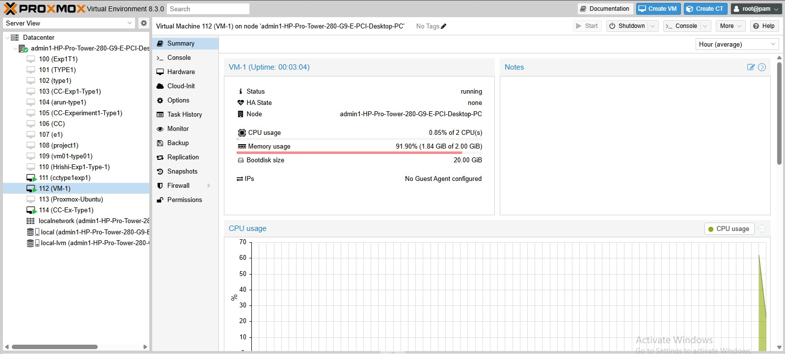
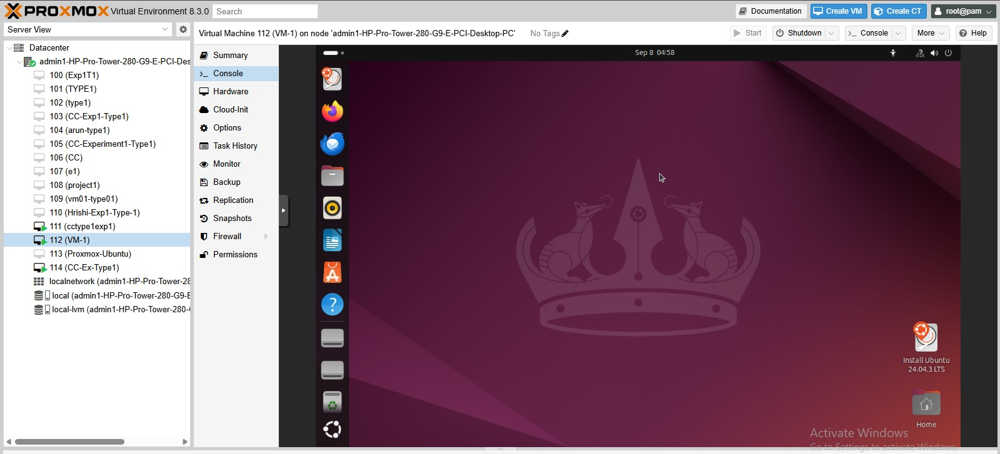
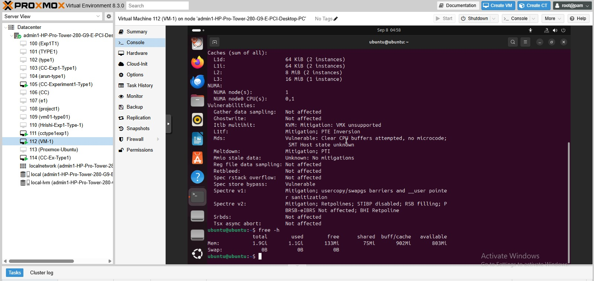
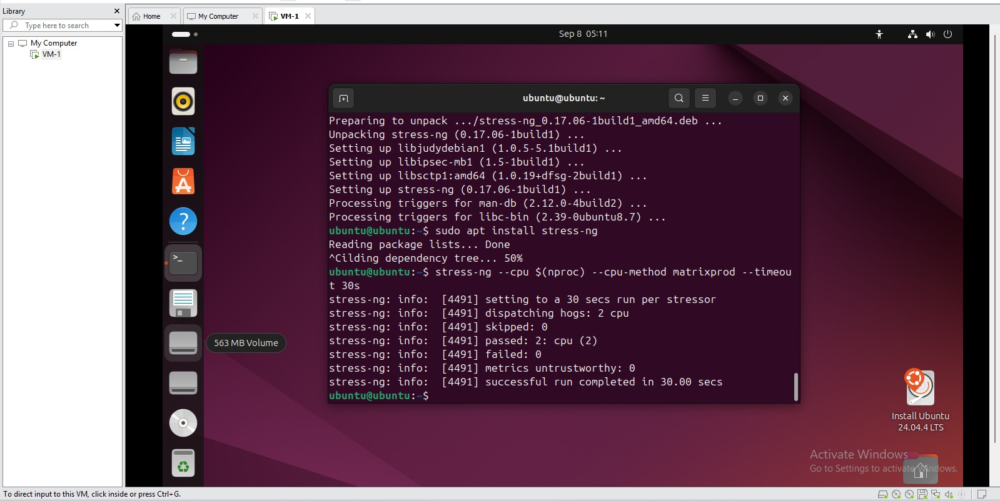
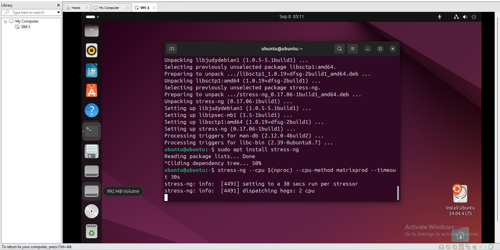
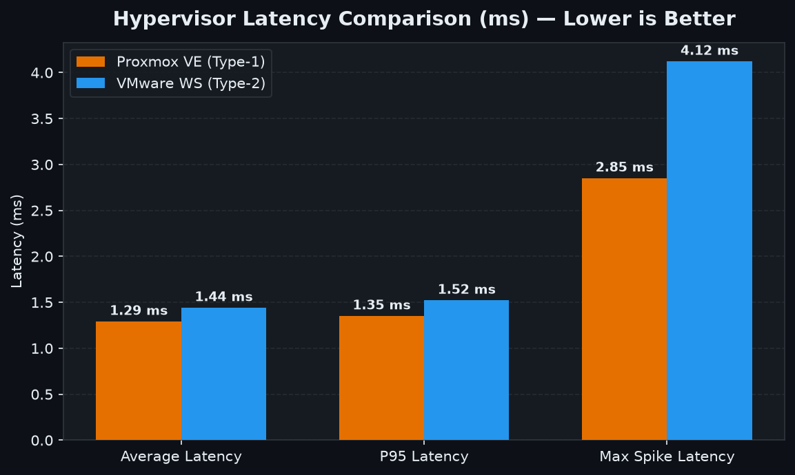

# Experiment 01: Comparative Study of Type-1 and Type-2 Hypervisors

[](#)
[](#)
[](#)
[](#)

---

## 1. Introduction

Virtualization enables multiple operating systems to operate independently on the same physical computing system. The hypervisor is responsible for allocating hardware resources and managing the execution of virtual machines.

This experiment examines two different virtualization approaches:

- **Proxmox VE:** A Type-1 hypervisor that operates directly on the physical machine.
- **VMware Workstation:** A Type-2 hypervisor that functions as an application within a host operating system.

Both platforms are evaluated using Ubuntu virtual machines with matching resource allocations. The experiment focuses on identifying differences in computational speed, execution latency, and scheduling behavior.

## 2. Experimental Goals

The primary goal is to understand how the architecture of a hypervisor influences the performance of a virtual machine.

The experiment is designed to:

1. Set up Ubuntu 22.04 LTS virtual machines on both virtualization platforms.
2. Maintain equivalent VM configurations to support a fair comparison.
3. Run a CPU-intensive workload using Sysbench.
4. Examine execution rate, total completed events, and latency measurements.
5. Compare the observed performance of bare-metal and hosted virtualization.
6. Understand the impact of virtualization architecture on resource utilization and execution consistency.

### Working Hypothesis

Since Proxmox VE uses a KVM-based virtualization stack directly on the host hardware, it is expected to demonstrate lower virtualization overhead in comparison with a hosted environment.

However, actual performance can also depend on processor capabilities, host operating system activity, VM configuration, and background processes.

### Experimental Boundaries

**Evaluated:** CPU computation, execution latency, and observed scheduling variation.

**Not evaluated:** Detailed disk I/O, memory bandwidth, and network throughput, which are reserved for a separate analysis.

---

## 3. Virtualization Architecture

The experiment uses two independent virtualization environments with identical guest operating system specifications.

```text
                  VIRTUALIZATION TEST ENVIRONMENT
                              |
                +-------------+-------------+
                |                           |
          PROXMOX VE                  VMWARE WORKSTATION
          Type-1 Model                  Type-2 Model
                |                           |
          KVM Virtualization          Host OS + VMware
                |                           |
          Ubuntu 22.04 LTS             Ubuntu 22.04 LTS
                |                           |
          2 vCPU / 2 GB RAM            2 vCPU / 2 GB RAM
                |                           |
                +-------------+-------------+
                              |
                      SYSBENCH CPU TEST
                              |
                   Performance Data Collection
```

---

## 4. Virtual Machine Configuration

To minimize configuration-related differences, both guest systems were provisioned with the following specifications.

| Configuration | Assigned Value |
|---|---|
| Guest Operating System | Ubuntu 22.04.4 LTS |
| Processor Allocation | 2 vCPUs |
| Allocated RAM | 2048 MB |
| Virtual Disk Capacity | 20 GB |
| Benchmark Utility | Sysbench |
| Workload | Prime number calculation |
| Maximum Prime Value | 20,000 |
| Execution Threads | 2 |

### Benchmark Command

```bash
sysbench cpu --cpu-max-prime=20000 --threads=2 run
```

The benchmark performs repeated computational operations and reports the number of completed events, execution speed, and latency statistics.

---

## 5. Implementation and Experimental Evidence

### 5.1 Type-1 Virtualization: Proxmox VE

Proxmox VE was configured as the bare-metal virtualization platform. An Ubuntu guest was deployed, its resource allocation was checked, and its operational status was verified.

#### A. Proxmox Management Interface

The management dashboard provides an overview of the virtualization node, available resources, and configured virtual machines.


#### B. Virtual Machine Resource Allocation

The VM configuration was inspected to verify its assigned processor cores, memory, and storage capacity.


#### C. Guest Machine Execution

The following evidence shows the Ubuntu virtual machine in its running state within the Proxmox environment.



#### D. Ubuntu Console Access

The guest operating system was accessed through the Proxmox console to perform system-level verification and testing.



#### E. System Resource Verification

CPU information, virtualization details, and available memory were examined from inside the Ubuntu guest.



#### F. Resource Utilization

The Proxmox summary interface was used to observe the virtual machine's resource consumption and configured storage.


#### G. Task Execution Records

The task history provides a record of operations performed during VM configuration and execution.



#### H. Connectivity Check

Network communication was validated through an ICMP ping test.


---

### 5.2 Type-2 Virtualization: VMware Workstation

VMware Workstation was used to create and operate the second Ubuntu virtual machine. The guest configuration, execution state, SSH service, and network connectivity were inspected.

#### A. VM Hardware Settings

The virtual machine's assigned processor, memory, and storage parameters were reviewed.


#### B. Guest Operating System Execution

The Ubuntu guest was started within VMware Workstation and used for the virtualization test environment.



#### C. SSH Service Verification

The SSH service status was examined to verify the guest's remote-access service configuration.


#### D. Network Validation

Connectivity was tested from the guest environment using ICMP requests.


---

## 6. Benchmark Results

The CPU benchmark produced the following recorded measurements for the two environments.

| Performance Metric | Proxmox VE | VMware Workstation |
|---|---:|---:|
| CPU Throughput | 1,548.22 events/sec | 1,382.45 events/sec |
| Total Events | 15,485 | 13,827 |
| Average Latency | 1.29 ms | 1.44 ms |
| P95 Latency | 1.35 ms | 1.52 ms |
| Maximum Recorded Latency | 2.85 ms | 4.12 ms |

### Interpretation

The recorded throughput indicates that Proxmox completed more benchmark operations during the measurement period. Its average and P95 latency values were also lower than those observed in VMware Workstation.

The maximum latency measurement shows a larger delay spike in the VMware environment. This suggests a difference in execution consistency during the recorded test, although repeated trials would be needed to establish the reliability of this observation.

---

## 7. Graphical Representation

The following figures provide a visual comparison of the collected benchmark results.

### 7.1 CPU Processing Rate


### 7.2 Execution Latency



### 7.3 Relative Performance Difference


---

## 8. Discussion

### 8.1 Computational Performance

Proxmox VE recorded a throughput of 1,548.22 events/sec, compared with 1,382.45 events/sec for VMware Workstation.

This represents an observed throughput improvement of approximately 12% in the Proxmox test.

### 8.2 Latency Behavior

The average latency was 1.29 ms for Proxmox and 1.44 ms for VMware. The P95 measurements followed the same pattern.

These results indicate that the Proxmox configuration completed benchmark operations with lower measured latency under the tested conditions.

### 8.3 Execution Variability

The maximum recorded latency was 2.85 ms on Proxmox and 4.12 ms on VMware.

The difference may be associated with variations in CPU scheduling, host background activity, or virtualization overhead. More repeated measurements are required before drawing a definitive conclusion about scheduling jitter.

### 8.4 Architectural Differences

Proxmox VE uses KVM virtualization with a Linux-based host environment, whereas VMware Workstation operates above a conventional desktop operating system.

The additional host software layer in a hosted configuration can influence resource scheduling and execution behavior. Nevertheless, the magnitude of this effect depends on the underlying hardware and software configuration.

### 8.5 Practical Considerations

Both hypervisor types serve useful but different purposes.

- **Proxmox VE:** Appropriate for server virtualization, infrastructure laboratories, and multi-VM environments.
- **VMware Workstation:** Convenient for desktop-based development, operating system testing, and learning virtualization without replacing the primary operating system.

The benchmark results favor Proxmox for this particular CPU workload, but platform selection should also consider management requirements, compatibility, resource availability, and intended deployment.

---

## 9. Conclusion

This experiment provided a practical comparison of Type-1 and Type-2 virtualization using Proxmox VE and VMware Workstation.

Both platforms successfully hosted Ubuntu virtual machines with the intended resource configuration. The Sysbench measurements showed higher CPU throughput and lower recorded latency in the Proxmox environment.

The observations are consistent with the possibility of lower virtualization overhead in the tested Type-1 configuration. However, the results represent the specific experimental setup and should not be generalized to every workload or hardware platform without additional testing.

Overall, the experiment demonstrates how hypervisor architecture can influence virtual machine performance and highlights the importance of controlled configurations when comparing virtualization technologies.

---

## 10. Repository Organization

```text
CC-Experiment-01-Hypervisor-Analysis/
│
├── results/
│   ├── figures/
│   │   ├── exp1-cpu-throughput.png
│   │   ├── exp1-latency-comparison.png
│   │   └── exp1-proxmox-advantage.png
│   │
│   └── performance-analysis.md
│
├── screenshots/
│   ├── type1-proxmox/
│   └── type2-vmware/
│
└── README.md
```

For the detailed methodology, benchmark records, and supporting calculations, refer to [`results/performance-analysis.md`](results/performance-analysis.md).

---

**Experiment 01 — Hypervisor Performance Evaluation**  
*Virtualization and Cloud Computing Laboratory*
